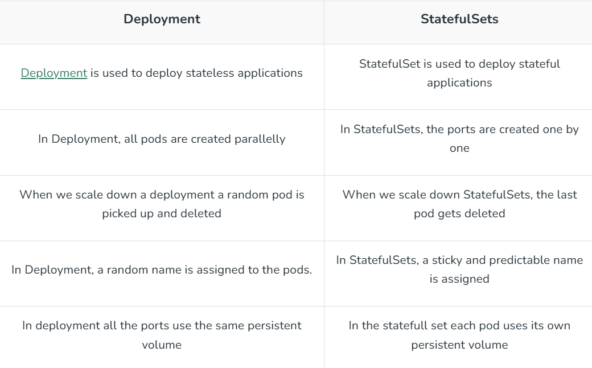

### Difference between the Stateful and Stateless application

#### Differnce between StatefulSet and the Deployment

## Statefulset
- Stateful application manager 
- This is useful for managing applications that need persistent storage or a stable, unique network identity.
- It is responsible for ordering and uniqueness of pod
**statefulset provides**
- Stable, unique network identifiers.
- Stable, persistent storage.
- Ordered, graceful deployment and scaling.
- Ordered, automated rolling updates.
### Drawbacks:
- deleting or scaling down will not delete the volumes[must delete manual]
- does not give the guaratees of termination of pods directly after StatefulSet is delete
```bash
kubectl get sts
```
```bash
kubectl get pods
```


### Rolling update and Rollback:
1. Rolling update:
- similar to the Deployment
2. Rollback:
- you need to rollback manual in the SatefulSet
- version 1.0 to 2.0 
- edit the manifest file with:
```bash
kubectl edit StatefulSet name_statefulfile
```
- edit the following section:
```yml
spec: 
  containers:
   - name: myapp
     image:nginx:v1
```
- apply manifest file 
```bash
kubectl apply -f versio.yanl
```
- to check the version:
```bash
kubectl logs pod_name
```


