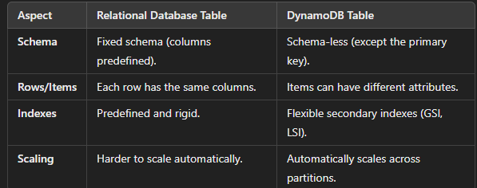

### Dynamodb:
- Amazon DynamoDB is a fully managed NoSQL database service provided by AWS.
- It is designed for applications requiring high performance at any scale, offering seamless scalability, low latency, and flexible data modeling.
#### Key features:
- NoSQL Database
- Fully Managed
- Scalability
- Performance
- High Availability and Durability
#### If dynamodb is nosql then why we create table?

### Expalin statelocking:
- State locking ensures that only one process or task can access or modify a resource or perform a specific operation at a given time.
- It is crucial in distributed systems to avoid race conditions or conflicts when multiple instances try to perform the same operation simultaneously.
#### suppose :
- On AWS account two devops engineer A and B trying to apply the **IaC** code simultaneously oit will create the conflict so to avoid this conflict we use DynamoDb to handle the conflict.
- DynamoDb will keep waiting one of the devops engineer until first one complete its work.
### create the dynamodb table:
```hcl
resource "aws_dynamodb_table" "terraform_locks" {
  name         = "new-table1020"
  billing_mode = "PAY_PER_REQUEST" # billing_mode:
                                   #PAY_PER_REQUEST: Auto-scaling.
                                   #PROVISIONED: Manually define read/write capacity units.
  hash_key     = "LockID"    ##hash_key: The primary key for the table.
  range_key      = "sort_key"   ### range_key: Optional, defines the sort key.
  attribute {   ## attribute: Specifies the data types for keys and other attributes.
    name = "LockID"
    type = "S"
  }

  tags = {
    Environment = "Production"
    Team        = "DevOps"
  }
}
```
### steps to make the backend to local
```hcl
terraform {
  backend "local" {
    path = "./terraform.tfstate" # The location to store the state file
  }
}
```
#### Diference between the --migrate and --reconfigure flags in terraform init command:
1. --migrate:
- Migrates the state file to the new backend.
- Useful when switching to a new backend and you want to move your state.
2. --reconfigure:
- Reinitializes the backend and provider configurations.
- Doesn’t migrate the state. It just reconfigures the setup according to the new settings.