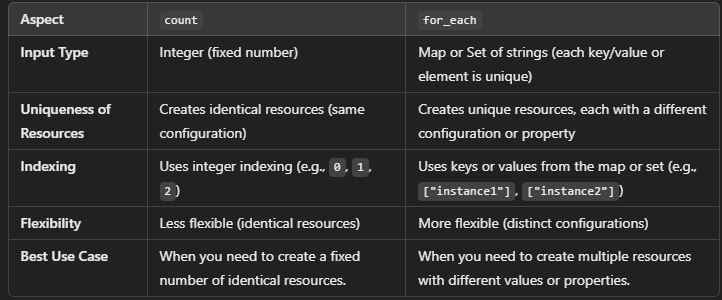

## COUNT:
- To create multiple instance of resource or module
- datatype: integer
- controls how many resources/modules should be created

- e.g
```hcl 
resource "aws_instance" "example" {
  count = 3  # Creates 3 instances with this given configuration
  ami = "ami-123456"
  instance_type = "t2.micro"
}

```

### Difference between  count and for_each:

