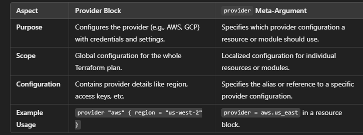

## PROVIDER:
- To specify which provider configuration to use for resource or modules
- type: provider block reference
- useful when using multiple configuration of same provider 

```hcl
provider "aws" {
  alias  = "us_east"
  region = "us-east-1"
}

resource "aws_instance" "example" {
  provider = aws.us_east
  ami           = "ami-12345678"
  instance_type = "t2.micro"
}
```

## difference between provider block and provider meta argument:


