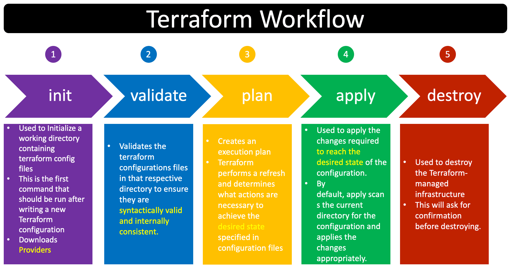
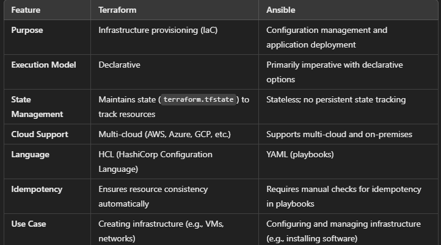

**## Terraform**
#### Terraform:
- Terraform is a opene-source infrastructure[IaC]
- The terraform uses the HCL [hashicrop configuration language] to write the files
- It allows you to automate the provisioning and management of infrastructure resources.
#### IaC:
- It is method of managing and provisioning IT infrastructure using code rather than manual configuration 
#### Purpose:
1. It supports multi-cloud and muliti-provider 
2. Terraform is declarative management tool
3. Terraform provides mutable and immutable infrastructure:
1. Mutable:
- Mutable infrastructure means you can modify or update resources in place. Changes are applied directly to existing resources, and their state is updated
- e.g suppose we want to change the instance_type

```hcl
resource "aws_instance" "example" {
  ami           = "ami-123456"
  instance_type = "t2.micro"
}
```
- plan and apply the following code the instance that is created with instance_type "t2.micro"
- Later, you decide to upgrade the instance type to t2.medium:
 
```hcl
resource "aws_instance" "example" {
  ami           = "ami-123456"
  instance_type = "t2.medium"
}
```
- Terraform will automatically modify the instance_type without destroying the created instance 
2. Immutable:
- Immutable infrastructure means that instead of modifying resources in place, Terraform destroys the existing resource and creates a new one. This ensures no drift in configuration and maintains a clean, predictable state.
- e.g uppose you want to change the ami-id of the instance you already created
```hcl
resource "aws_instance" "example" {
  ami           = "ami-789012" 
  instance_type = "t2.medium"
}
```
- from this ami-13453 to ami-31215423
```hcl
resource "aws_instance" "example" {
  ami           = "ami-3232445" 
  instance_type = "t2.micro"
}
```
- Terraform knows that the ami field is immutable (i.e., it cannot be changed for an existing instance).
- Terraform Plan will show that the existing EC2 instance needs to be destroyed and recreated with the new AMI.
4. State management:
- Terraform stores information about your managed infrastructure in a state file (default: terraform.tfstate).
- The state file is a JSON document that contains metadata about all resources, their attributes, and their relationships.

### Terraform workflow:


### Difference between the CloudFormation and Terraform:


### Difference between the Ansible and Terraform:


**#### Datatype in terraform:**
- The terraform provides the data types to define the variable block:
1. **string:**
- string are usually by double-quotes sequence of unicode characters.
- e.g "t2.micro"
2. **number:**
- numbers are repersented by unqouted sequence of digits with or without decimal point 
- e.g ports = 80
3. **bool:**
- boolean values are represented as unquoted symbols true or false
- e.g map_launch_public_ip = true
4. **null:**
-  You can return null in outputs if a condition is  not met.
- e.g map_launch_public_ip = null
5. **list():**
- represent by pair of square bracket containing comma-separarted sequence of values 
- contain similar type of data
- e.g ["string", "string2", "string3"]
6. **Tuples([string, bool, number]):**
- similar as the list but tuples allow you to declare
the all datatypes
- e.g
```hcl 
variable "settings" {
  type = tuple([string, number, bool])
  default = ["us-east-1", 3, true]
}

output "region" {
  value = var.settings[0]
}
```
7. **Set:**
- terraform does not directly support accessing elements of sets by index because sets are unordered collection:
- e.g 
```hcl
variable "example_set" {
  type    = set(string)
  default = ["apple", "banana", "cherry"]
}

output "set_to_list" {
  value = tolist(var.example_set)
}
```
8. **map/objects:** 
- represented by pair of curly braces containing a series of <key> = <value> pairs
- e.g 
```hcl
variable "region_map" {
  description = "Map of environment to AWS region"
  type        = map(string)
  default = {
    dev     = "us-west-1"
    staging = "us-west-2"
    prod    = "us-east-1"
  }
}

output "region_for_dev" {
  value = var.region_map["dev"]
}
```
