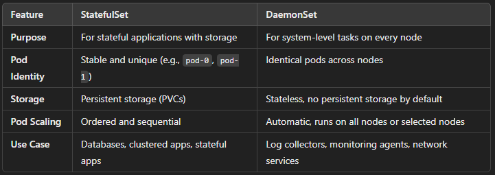

#### Difference between the StatefulSet and DaemonSet

#### Defination:
- It ensures that specific pod runs on all [or some] nodes in cluster
- It usually used to run the background task or agents which is neccessary for all the nodes
- such as monitoring, logging, storage and the network services
#### Key features:
1. **Pod deployment on all nodes:** ensures the copy of pod must contain on all or selected nodes
2. **Dynamic update:** it automatically add the pod when new nodes are created
3. **Selective node** trageting: control where the DaemonSet pods are scheduled by using node selectors
4. **Pod management:** if the pod are removed or deleted, it are created by the daemonset
### use cases:
- Mointoring 
- Logging
- Networking
- Storage
