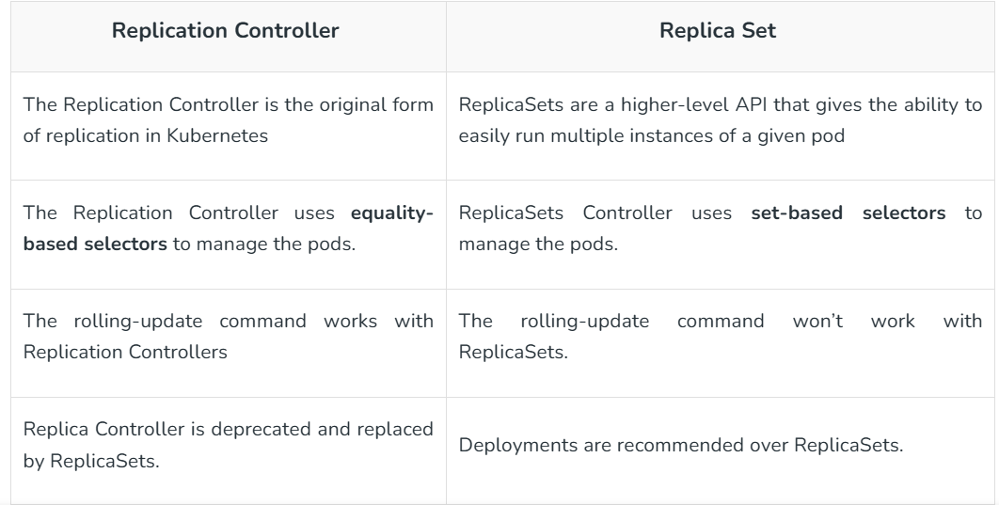

### ReplicationController:
- It is superseded from of ReplicaSet & Deployment
- used to manage the workload that can scale horizontally
- ensures that specified number of pod replicas are running at give time
- works on equality based selector

### Equality based:
- match resources based on key-value equality
- supports by almost all the k8s resources
1. key = value [equal to]
- Matches exactly one label value.
- Example: Select all pods with the label app=nginx.
```bash
 kubectl get pods -l app=nginx
```
2. key != value [not equal to]
- Matches all resources that do not have a specific label value.
- Example: Select all pods where the app label is not equal to nginx.
```bash
kubectl get pods -l app!=nginx
```
### Difference between ReplicationController and ReplicaSet
